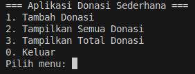

# 💝 Simple-Donation-App

A simple, console-based **Java OOP Donation App** that helps manage donations from multiple donors using proper **Object-Oriented Programming principles**:  
✅ Encapsulation — ✅ Inheritance — ✅ Polymorphism

---

## ✨ Features

- ✅ Register new donors
- 💸 Make donations (Cash / Transfer)
- 📜 View donation history
- 📊 Calculate total donations received
- 💡 Clean, modular project structure for learning and reuse

---

## 📂 Project Structure

```
Aplikasi Donasi Sederhana
├── bin
│   └── main
│       ├── app
│       │   └── MainApp.class
│       ├── model
│       │   ├── Donasi.class
│       │   ├── DonasiTransfer.class
│       │   ├── DonasiTunai.class
│       │   └── Donatur.class
│       └── service
│           └── DonasiManager.class
├── lib
├── picture
│   └── menu.png
├── README.md
└── src
    └── main
        ├── app
        │   └── MainApp.java
        ├── model
        │   ├── Donasi.java
        │   ├── DonasiTransfer.java
        │   ├── DonasiTunai.java
        │   └── Donatur.java
        └── service
            └── DonasiManager.java
```

---

## 🧱 OOP Concepts Used

| Concept         | Implementation |
|----------------|----------------|
| **Encapsulation**  | Private fields with getters/setters in `Donatur`, `Donasi`, etc. |
| **Inheritance**    | `Donasi` superclass extended by `DonasiTunai` and `DonasiTransfer` |
| **Polymorphism**   | Method `tampilkanInfo()` behaves differently for each donation type |

---

## 🚀 How to Run

### 1. Compile
Make sure you're in the `src` directory:
```bash
cd src
javac app/MainApp.java model/*.java service/*.java
```

### 2. Run the App
```bash
java app.MainApp
```

---

## 📸 Example Menu Output


---

## 📌 Sample Code Snippet

Here’s how **polymorphism** is applied in this project:

```java
Donasi donasi1 = new DonasiTunai(donatur1, 100000);
Donasi donasi2 = new DonasiTransfer(donatur2, 200000);

donasi1.tampilkanInfo(); // Output: Donasi Tunai...
donasi2.tampilkanInfo(); // Output: Donasi Transfer...
```

---

## 🔮 Future Improvements

- 📝 Add file-based or database persistence (save/load data)
- 🖥️ Build a GUI version using Swing or JavaFX
- 🔐 Add user authentication for admin features
- 🌐 Export donation data to CSV or PDF

---

## 📚 License

This project is free and open-source, intended for learning, education, and practice.
